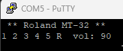

# SED1200Emu
This Emulator is intended to replace hard-to-obtain Epson SED1200 based LCD modules with common HD44780 ones. The original project page can be found here http://sensi.org/~tnt23/sed1200emu/index.html. The original goal is for having a replacement LCD for the Roland MT-32, but the display could be adapted for other projects. All attempts to reach the original designer have failed. Please reach out to me if you have any information about this. 

## Building and Installation
The main driver and translator for this project is an ATMEGA8L-8AU which can still be purchased on popular sites like Mouser and Digi-key. This IC may become obsolete, so the intention is to adapt as they become less available. The gerber files, BOM, Binary HEX files will also be provided as they become current and available. All current releases are in beta, and come with no warranty. 

### ATMEGA8 Flashing
When programming the ATMEGA8 it is important to use the correct configuration. This will enable the external clocks and any other flags needed for binary to run correctly. 

Fuse Low Byte: 0xBF

Fuse High Bte: 0xD9

Lock Bit Byte: 0xFF

### Compiling
Download and install WinAVR for minimum compiling support. Using command prompt or windows powershell, run make in the src directory.

Note: You can optionally replace the AVR compiling files to manually update to newer versions. 

### UART Config
For debugging or logging display message, connect via serial to GND, TXD, RXD at 9600 baud.

UART Serial out display clone (and debugging).

### Optional Headers
There are three headers that are considered optional, but recommended if you are developing or want to reprogram the ATMEGA8 after it is soldered to the board. The SPI header will provide connection for flashing, and the UART header will give you access to feedback and debug information for code development. 

## Development Notes
At the moment, 20x2 HD44780 LCD is too large as a direct replacement for the MT-32. Adaptation will be needed in the form of a redesigned 3D printed face plate for the current LCD. If you have interest in helping design something like this, please get in touch! I have searched around for better fitting 20x2 LCD's but I have not found anything that would match. 

Another option is to program new methods that adapts the display to a 16x2 LCD. This might need some elaborate programming to work. 

## License Information
The original release this project is derived from Tim Tashpulatov without license or warranty. The updated revisions of this project released in 2024 include a GPL v3 license which can be found here in the LICENSE file. 

Source code and software license - [GPL v3](https://github.com/skadarnold/sed1200emu/blob/master/LICENSE)

Hardware design license - [CERN OHL-S](https://ohwr.org/project/cernohl/-/wikis/uploads/819d71bea3458f71fba6cf4fb0f2de6b/cern_ohl_s_v2.txt)

## Support the Developer
This project is brought to you free and open source, but it is not free to develop. If you like this project please consider supporting this and future developments. 

https://www.patreon.com/RetroLoom
